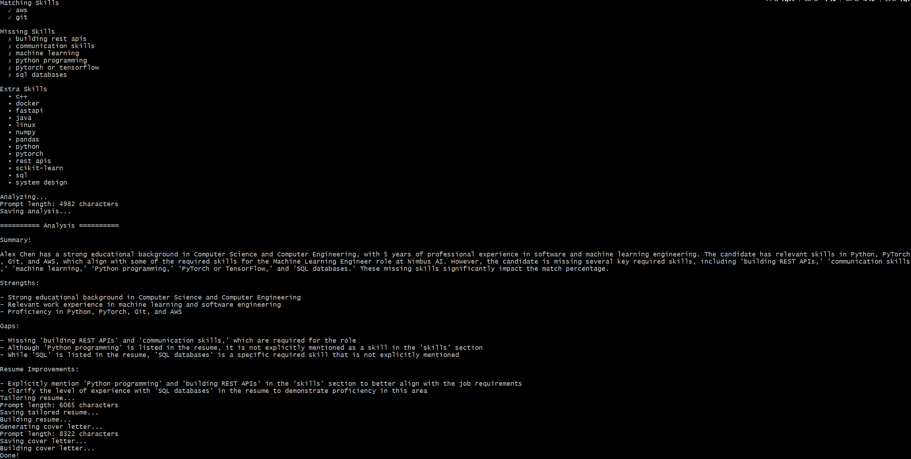

# Job Search AI Agent


An AI-powered job application assistant that analyzes resumes and job descriptions, evaluates candidate fit, tailors resumes for specific roles, generates personalized, resume-grounded cover letters, and exports professional DOCX documents.

The project combines traditional software engineering with Large Language Models (LLMs) to automate the most time-consuming parts of the job application process while ensuring all generated content remains grounded in the candidate's actual experience.

---

## Features

- Extract text from PDF resumes
- Convert resumes into structured data using an LLM
- Extract structured information from job descriptions
- Compare resume skills against job requirements
- Analyze resume-job fit using an LLM
- Tailor resumes without inventing experience
- Generate personalized, resume-grounded cover letters
- Export professional resume and cover letter DOCX documents
- Save intermediate JSON artifacts for transparency and debugging

---

## Architecture

The overall application pipeline is shown below.

<p align="center">
    
</p>

---

## Example Output

### Tailored Resume

<p align="center">
    
</p>

---

### Generated Cover Letter

<p align="center">
    
</p>

---

### Pipeline Execution

<p align="center">
    
</p>

---

## Pipeline

The application performs the following steps:

1. Parse a PDF resume.
2. Extract structured resume information using an LLM.
3. Extract structured information from a job description.
4. Compare resume skills against job requirements.
5. Analyze candidate strengths, gaps, and overall match.
6. Tailor the resume for the target role.
7. Generate a personalized cover letter.
8. Export both documents as professional DOCX files.

---

## Project Structure

```text
job-search-ai-agent/
│
├── assets/
│   ├── architecture.png
│   ├── cover_letter.png
│   ├── resume.png
│   └── terminal.png
│
├── builders/
│   ├── cover_letter_builder.py
│   └── resume_builder.py
│
├── data/
│   ├── input/
│   └── output/
│
├── models/
│   ├── analysis.py
│   ├── cover_letter.py
│   ├── job.py
│   ├── match.py
│   ├── resume.py
│   └── tailored_resume.py
│
├── prompts/
│   ├── cover_letter_prompt.py
│   ├── job_prompt.py
│   ├── match_prompt.py
│   ├── resume_prompt.py
│   └── tailor_prompt.py
│
├── services/
│   ├── cover_letter_generator.py
│   ├── job_extractor.py
│   ├── llm.py
│   ├── match_analyzer.py
│   ├── resume_extractor.py
│   ├── resume_parser.py
│   ├── resume_tailor.py
│   └── skill_matcher.py
│
├── utils/
├── config.py
├── main.py
├── requirements.txt
├── LICENSE
└── README.md
```

---

## Technologies

### AI

- Ollama
- Qwen3 14B
- Pydantic

### Python

- PyPDF
- python-docx

### Development

- Ruff

---

## Installation

Clone the repository.

```bash
git clone https://github.com/<username>/job-search-ai-agent.git
cd job-search-ai-agent
```

Install the dependencies.

```bash
pip install -r requirements.txt
```

Install and start Ollama.

Pull the default model.

```bash
ollama pull qwen3:14b
```

Verify the model name in `config.py` if using a different model.

---

## Usage

Place your input files in:

```text
data/input/
├── resume.pdf
└── job.txt
```

Run the application.

```bash
python main.py
```

The application generates:

```text
data/output/
├── analysis.json
├── analysis.md
├── cover_letter.docx
├── cover_letter.json
├── match.json
├── resume.json
├── tailored_resume.docx
└── tailored_resume.json
```

Replace the example input files with your own resume and target job description to generate customized application materials.

---

## Future Improvements

- Streamlit web interface
- Batch processing for multiple job postings
- Interview question generation
- Resume version comparison
- ATS compatibility scoring
- Application history dashboard

---

## Disclaimer

This project assists with resume tailoring and cover letter generation using Large Language Models. All generated documents should be reviewed before submitting job applications.

---

## License

This project is licensed under the MIT License. See the `LICENSE` file for details.