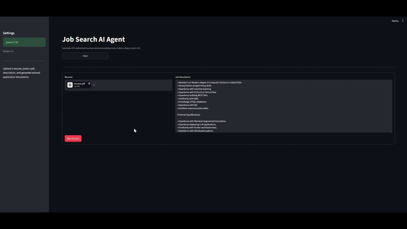
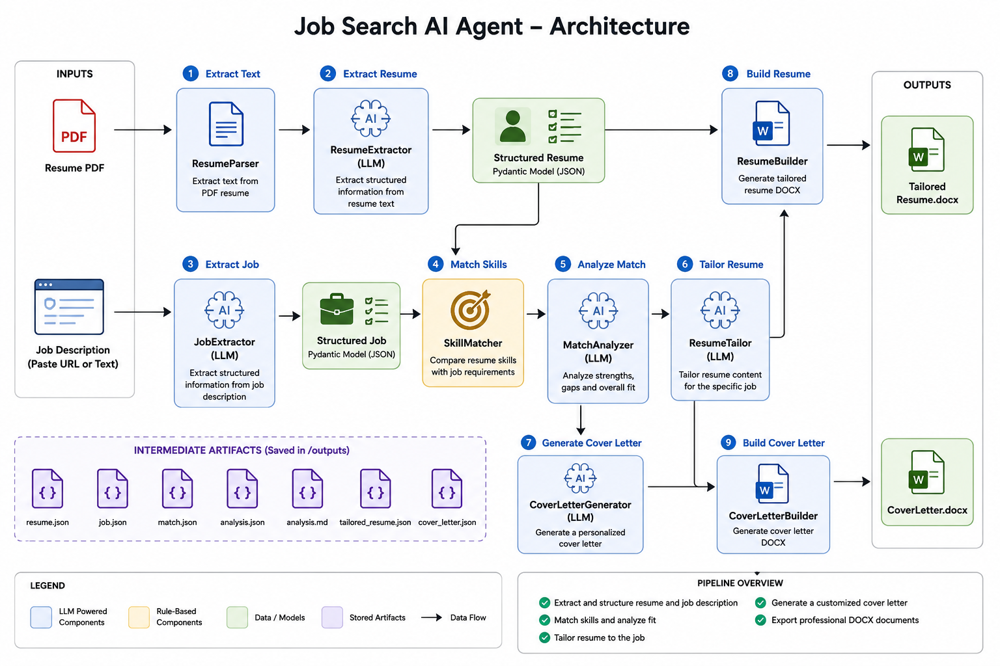
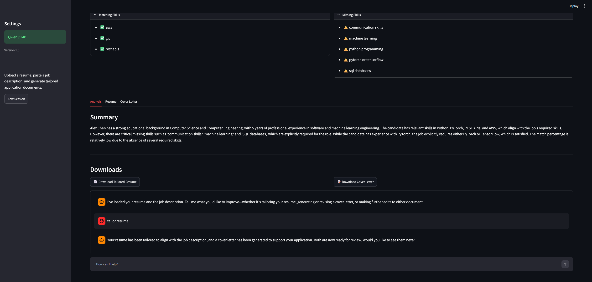
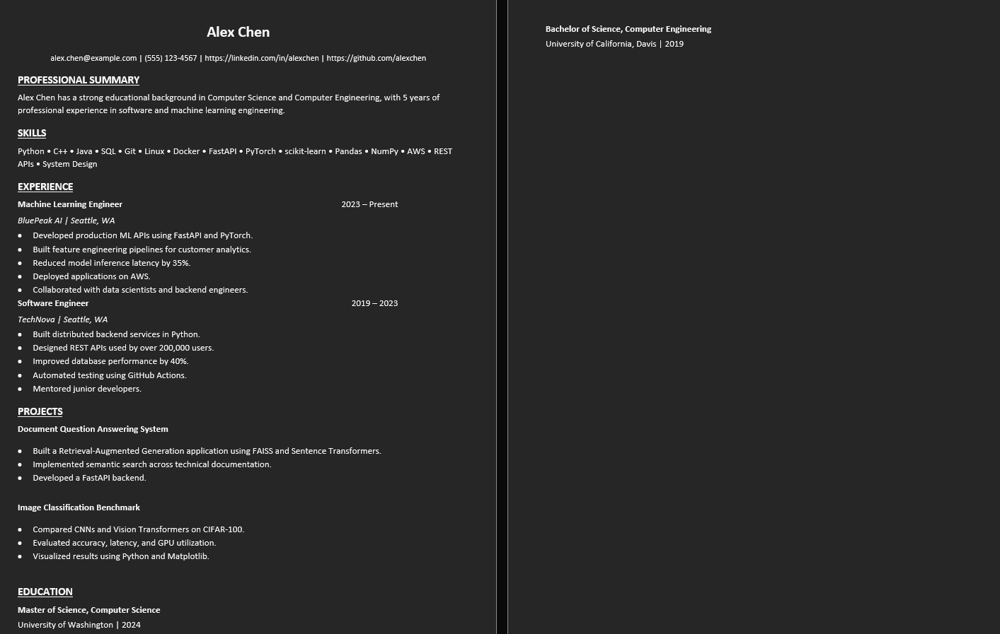
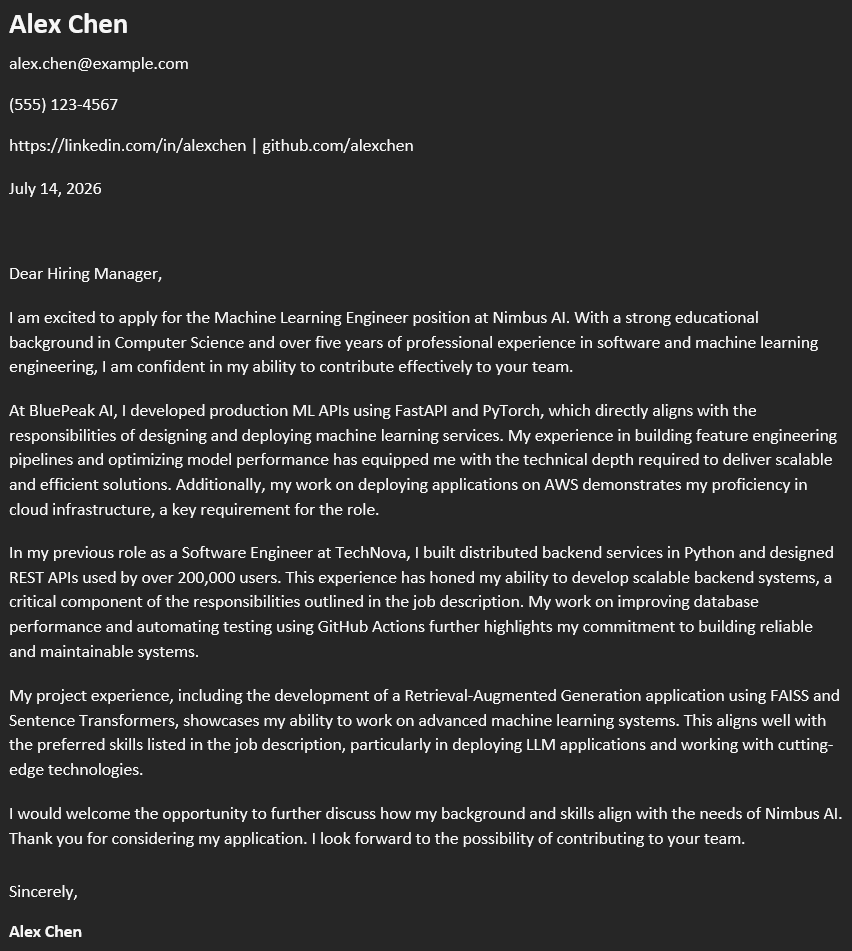

# Job Search AI Agent


An AI-powered conversational job application assistant that uses a modular LLM agent to analyze resumes, understand job descriptions, tailor resumes for specific roles, iteratively revise documents through natural language, generate personalized cover letters, and export professional DOCX documents.

The application combines traditional software engineering principles with Large Language Models (LLMs) to automate the most time-consuming parts of the job application process while ensuring generated content remains grounded in the candidate's actual experience.

---

# Demo

<p align="center">
    
</p>

---

# Features

- Upload PDF resumes
- Extract structured resume information using an LLM
- Parse job descriptions into structured data
- Compare resume skills against job requirements
- Analyze candidate strengths, weaknesses, and overall fit
- Tailor resumes without inventing experience
- Iteratively revise resumes through natural language conversation
- Generate personalized, resume-grounded cover letters
- Iteratively revise cover letters through conversation
- Export professional DOCX resume and cover letter documents
- Conversational Streamlit interface
- Modular LLM agent with planning and tool execution

---

# Architecture

The overall application architecture is shown below.

<p align="center">
    
</p>

---

# Agent Workflow

The application processes each user request using a planning agent.

```text
User Request
      │
      ▼
 Planner
      │
      ▼
 Select Tool
      │
      ▼
 Execute Tool
      │
      ▼
 Update Agent State
      │
      ▼
 Repeat Until Complete
      │
      ▼
 Conversational Response
```

Depending on the user's request, the planner dynamically selects one or more tools, including:

- Resume Extraction
- Job Extraction
- Skill Matching
- Resume Analysis
- Resume Tailoring
- Cover Letter Generation

This architecture allows the application to support conversational editing while maintaining a clean separation between planning, tool execution, and document generation.

---

# Example Conversation

Example requests include:

> Tailor my resume for this position.

> Make my professional summary shorter.

> Emphasize my machine learning experience.

> Generate a cover letter.

> Make the cover letter more enthusiastic.

> Rewrite the second paragraph.

---

# Example Output

## Streamlit Interface

<p align="center">
    
</p>

---

## Tailored Resume

<p align="center">
    
</p>

---

## Generated Cover Letter

<p align="center">
    
</p>

---

# Project Structure

```text
job-search-ai-agent/
│
├── agent/
│   ├── application_agent.py
│   ├── planner.py
│   ├── registry.py
│   ├── responder.py
│   ├── state.py
│   └── tools/
│
├── builders/
│   ├── cover_letter_builder.py
│   └── resume_builder.py
│
├── models/
│   ├── anaysis.py
│   ├── cover_letter.py
│   ├── job.py
│   ├── match.py
│   ├── pipeline_result.py
│   ├── resume.py
│   └── tailored_resume.py
│
├── prompts/
│   ├── cover_letter_prompt.py
│   ├── job_prompt.py
│   ├── match_prompt.py
│   ├── resume_prompt.py
│   └── tailor_prompt.py
│
├── services/
│   ├── cover_letter_generator.py
│   ├── job_extractor.py
│   ├── llm.py
│   ├── match_analyzer.py
│   ├── pipeline.py
│   ├── resume_extractor.py
│   ├── resume_parser.py
│   ├── resume_tailor.py
│   └── skill_matcher.py
│
├── ui/
│   ├── downloads.py
│   ├── form.py
│   ├── layout.py
│   ├── results.py
│   ├── session.py
│   └── sidebar.py
│
├── assets/
│
├── data/
│   ├── input/
│   └── output/
│
├── streamlit_app.py
├── config.py
├── requirements.txt
├── LICENSE
└── README.md
```

---

# Technologies

## AI

- Ollama
- Qwen3 14B
- Pydantic

## Backend

- Python
- Streamlit

## Document Processing

- PyPDF
- python-docx

## Architecture

- LLM Planning Agent
- Tool Registry
- Modular Service Layer
- Stateful Conversation Management

## Development

- Ruff
- Black
- Pytest

---

# Installation

Clone the repository.

```bash
git clone https://github.com/<username>/job-search-ai-agent.git
cd job-search-ai-agent
```

Install the dependencies.

```bash
pip install -r requirements.txt
```

Install and start Ollama.

Pull the default model.

```bash
ollama pull qwen3:14b
```

If you use a different model, update the configuration accordingly.

---

# Usage

Start the application.

```bash
streamlit run streamlit_app.py
```

Upload:

- A PDF resume
- A job description

Then interact with the assistant through natural language.

Examples:

- Tailor my resume for this role.
- Generate a cover letter.
- Make the summary more concise.
- Highlight my leadership experience.
- Rewrite the cover letter to sound more confident.

Generated documents can be downloaded directly from the application.

---

# How It Works

The application uses a modular planning agent to process each request.

1. Parse the uploaded PDF resume.
2. Extract structured resume information using an LLM.
3. Extract structured information from the job description.
4. Compare resume skills against job requirements.
5. Analyze strengths, weaknesses, and overall fit.
6. Tailor the resume.
7. Generate or revise a cover letter.
8. Export professional DOCX documents.
9. Continue refining documents through conversation.

---

# Design Goals

- Maintain factual consistency with the original resume
- Never invent work experience or skills
- Keep generated documents grounded in the candidate's background
- Support iterative editing through conversation
- Separate planning, tool execution, and document generation into modular components

---

# Future Improvements

- Support additional LLM providers
- Resume version comparison
- ATS compatibility scoring
- Interview question generation
- Batch processing for multiple job descriptions
- Application history and document management

---

# Disclaimer

This project assists with resume tailoring and cover letter generation using Large Language Models. All generated documents should be reviewed before submitting job applications.

---

# License

This project is licensed under the MIT License. See the `LICENSE` file for details.