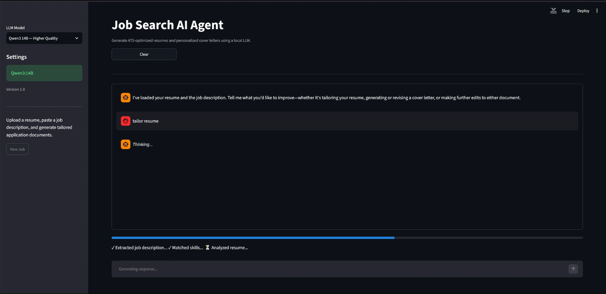
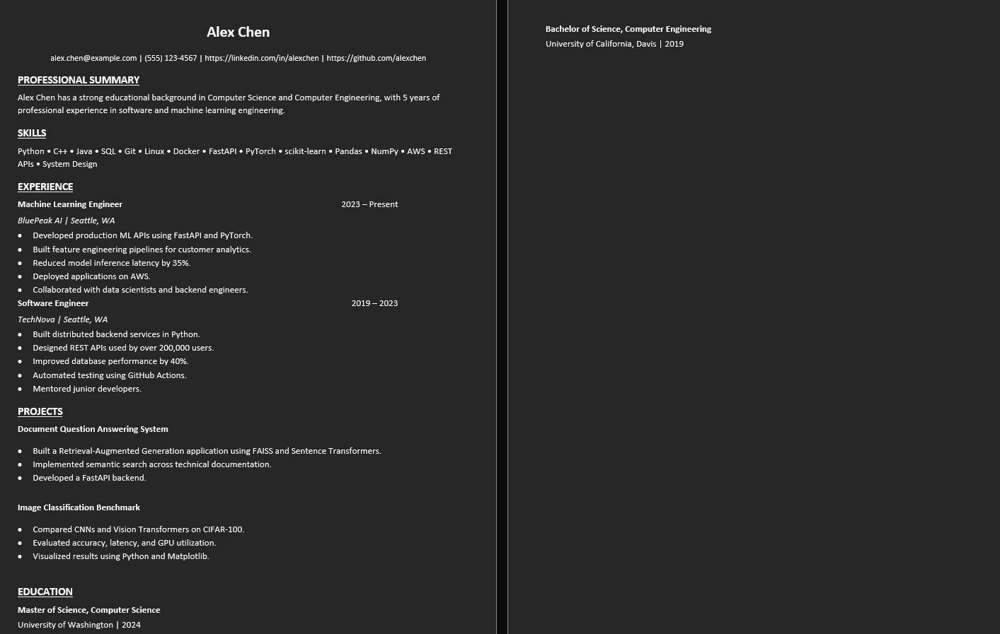
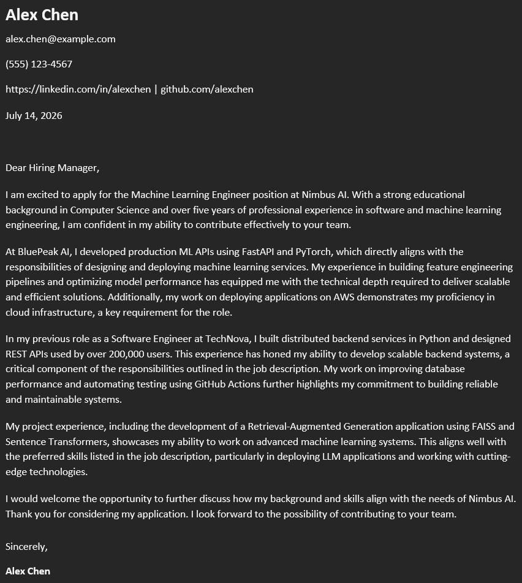

# Job Search AI Agent


An AI-powered conversational job application assistant that uses a modular LLM agent to analyze resumes, understand job descriptions, tailor resumes for specific roles, iteratively revise documents through natural language, generate personalized cover letters, prepare interview questions and answers, and export professional DOCX documents.

The application combines traditional software engineering principles with Large Language Models (LLMs) to automate the most time-consuming parts of the job application process while ensuring generated content remains grounded in the candidate's actual experience.

---

# Demo

<p align="center">
    
</p>

---

# Features

- Upload PDF resumes
- Cache and reuse previously extracted resumes
- Extract structured resume information using an LLM
- Parse job descriptions into structured data
- Compare resume skills against job requirements
- Analyze candidate strengths, weaknesses, and overall fit
- Tailor resumes without inventing experience
- Explain why resume experience and projects were changed
- Compare original and tailored resume match scores
- Measure ATS keyword coverage across resume content
- Show covered and missing job-specific keywords
- Iteratively revise resumes through natural language conversation
- Undo the last resume edit
- Generate personalized, resume-grounded cover letters
- Iteratively revise cover letters through conversation
- Undo the last cover letter edit
- Generate technical interview questions
- Generate behavioral interview questions
- Generate role-specific interview questions
- Generate suggested answers to interview questions
- Export professional DOCX resume and cover letter documents
- Conversational Streamlit interface
- Modular LLM agent with planning and tool execution
- Stateful application sessions

---

# Architecture

The overall application architecture is shown below.

<p align="center">
    
</p>

---

# Agent Workflow

The application processes each user request using a planning agent.

```text
User Request
      │
      ▼
   Planner
      │
      ▼
 Select Tool
      │
      ▼
 Execute Tool
      │
      ▼
Update Agent State
      │
      ▼
 Repeat Until Complete
      │
      ▼
Conversational Response
```

Depending on the user's request, the planner dynamically selects one or more tools, including:

- Resume Extraction
- Job Extraction
- Skill Matching
- Resume Analysis
- Resume Tailoring
- Cover Letter Generation
- Interview Question Generation
- Interview Answer Generation

The planner uses the current application state and tool history to determine which operation should execute next.

This architecture allows the application to support conversational editing while maintaining a clean separation between planning, tool execution, state management, and document generation.

---

# Example Conversation

Example requests include:

> Tailor my resume for this position.

> Make my professional summary shorter.

> Emphasize my machine learning experience.

> Why did you change my experience section?

> Undo my last resume edit.

> Generate a cover letter.

> Make the cover letter more enthusiastic.

> Rewrite the second paragraph.

> Generate interview questions for this role.

> Give me some technical interview questions.

> Generate an answer for this question.

The application can determine which tool is required based on the user's latest request while using the existing application state as context.

---

# Example Output

## Streamlit Interface

<p align="center">
    
</p>

---

## Resume Match Improvement

The application compares the original resume against the tailored resume.

It provides both a skill match score and broader ATS keyword coverage.

### Skill Match

```text
Original Resume     Tailored Resume     Improvement
25.0%               25.0%               +0.0%
```

### ATS Keyword Coverage

```text
Original Resume     Tailored Resume     Improvement
37.5%               62.5%               +25.0%
```

ATS keyword coverage also identifies which job requirements are represented in the resume and which remain missing.

---

## Resume Changes

The application displays changes made during tailoring and explains why relevant experience or projects were modified.

```text
Experience — Machine Learning Engineer

Original
• ...

Tailored
• ...

Why this changed
Emphasized existing machine learning and REST API experience
because these technologies are relevant to the target role.
```

---

## Interview Preparation

Interview preparation is available on request and includes:

- Technical questions
- Behavioral questions
- Role-specific questions
- Suggested answers

Answers can be generated individually for specific interview questions.

---

## Tailored Resume

<p align="center">
    
</p>

---

## Generated Cover Letter

<p align="center">
    
</p>

---

# Project Structure

```text
job-search-ai-agent/
│
├── agent/
│   ├── application_agent.py
│   ├── decision.py
│   ├── planner.py
│   ├── registry.py
│   ├── responder.py
│   ├── state.py
│   └── tools/
│       ├── analyze_resume.py
│       ├── extract_job.py
│       ├── generate_cover_letter.py
│       ├── generate_interview_answer.py
│       ├── generate_interview_questions.py
│       ├── match_skills.py
│       └── tailor_resume.py
│
├── builders/
│   ├── cover_letter_builder.py
│   └── resume_builder.py
│
├── models/
│   ├── analysis.py
│   ├── cover_letter.py
│   ├── interview_answer.py
│   ├── interview_questions.py
│   ├── job.py
│   ├── match.py
│   ├── pipeline_result.py
│   ├── resume.py
│   └── tailored_resume.py
│
├── prompts/
│   ├── cover_letter_prompt.py
│   ├── interview_answer_prompt.py
│   ├── interview_questions_prompt.py
│   ├── job_prompt.py
│   ├── match_prompt.py
│   ├── resume_prompt.py
│   └── tailor_prompt.py
│
├── services/
│   ├── cover_letter_generator.py
│   ├── interview_answer_generator.py
│   ├── interview_question_generator.py
│   ├── job_extractor.py
│   ├── llm.py
│   ├── match_analyzer.py
│   ├── pipeline.py
│   ├── resume_extractor.py
│   ├── resume_parser.py
│   ├── resume_tailor.py
│   └── skill_matcher.py
│
├── ui/
│   ├── downloads.py
│   ├── form.py
│   ├── layout.py
│   ├── results.py
│   ├── session.py
│   └── sidebar.py
│
├── utils/
│   └── resume_diff.py
│
├── assets/
│
├── data/
│   ├── input/
│   └── output/
│
├── streamlit_app.py
├── config.py
├── requirements.txt
├── LICENSE
└── README.md
```

---

# Technologies

## AI

- Ollama
- Qwen3 14B
- Pydantic

## Backend

- Python
- Streamlit

## Document Processing

- PyPDF
- python-docx

## Architecture

- LLM Planning Agent
- Tool Registry
- Modular Service Layer
- Stateful Conversation Management
- Structured Pydantic Outputs

## Development

- Ruff
- Black
- Pytest

---

# Installation

Clone the repository.

```bash
git clone https://github.com/<username>/job-search-ai-agent.git
cd job-search-ai-agent
```

Install the dependencies.

```bash
pip install -r requirements.txt
```

Install and start Ollama.

Pull the default model.

```bash
ollama pull qwen3:14b
```

If you use a different model, update the configuration accordingly.

---

# Usage

Start the application.

```bash
streamlit run streamlit_app.py
```

Upload:

- A PDF resume
- A job description

Then interact with the assistant through natural language.

Examples:

- Tailor my resume for this role.
- Generate a cover letter.
- Make the summary more concise.
- Highlight my leadership experience.
- Rewrite the cover letter to sound more confident.
- Explain why you changed my experience.
- Undo my last resume edit.
- Generate interview questions.
- Generate an answer for this interview question.

Generated documents can be downloaded directly from the application.

---

# How It Works

The application uses a modular planning agent to process each request.

1. Parse the uploaded PDF resume.
2. Extract structured resume information using an LLM.
3. Extract structured information from the job description.
4. Compare resume skills against job requirements.
5. Analyze strengths, weaknesses, and overall fit.
6. Tailor the resume while preserving factual accuracy.
7. Generate or revise a cover letter.
8. Compare the original and tailored resume skill matches.
9. Calculate ATS keyword coverage across the resume.
10. Identify covered and missing job requirements.
11. Generate interview questions on request.
12. Generate suggested interview answers on request.
13. Export professional DOCX documents.
14. Continue refining documents through conversation.

---

# Resume Tailoring

Resume tailoring is designed to improve relevance while preserving factual accuracy.

The tailoring process:

- Preserves companies and job titles
- Preserves employment dates
- Preserves education
- Preserves existing skills
- Preserves quantified accomplishments
- Rephrases existing experience rather than inventing new experience
- Reorders skills based on relevance
- Emphasizes relevant existing technologies and accomplishments
- Preserves the number and order of work experience and project entries

The system also generates explanations for meaningful experience and project changes so users can review why a particular section was modified.

---

# Match Analysis

The application provides multiple ways to evaluate resume alignment.

## Skill Match

Skill matching compares the skills explicitly listed in the resume against the required skills extracted from the job description.

## ATS Keyword Coverage

ATS keyword coverage checks whether required job skills appear anywhere in the structured resume content.

This allows the application to distinguish between:

- Skills explicitly listed in the Skills section
- Skills or terminology appearing in experience and project descriptions

The application compares coverage before and after tailoring to show whether the resume's alignment with the target role improved.

---

# Interview Preparation

Interview preparation can be requested conversationally rather than being generated automatically for every application.

The agent can generate:

- Technical questions
- Behavioral questions
- Role-specific questions

Users can then request a suggested answer for an individual question.

This keeps interview generation separate from the core resume and cover letter workflow while allowing the same application context to be reused.

---

# Undo and Iterative Editing

The application maintains previous versions of tailored documents to support iterative editing.

Users can:

- Revise a resume through natural language
- Undo the last resume edit
- Revise a cover letter through natural language
- Undo the last cover letter edit

This allows users to experiment with different versions without losing the previous result.

---

# Design Goals

- Maintain factual consistency with the original resume
- Never invent work experience or skills
- Keep generated documents grounded in the candidate's background
- Support iterative editing through conversation
- Provide transparency into resume changes
- Quantify resume/job alignment before and after tailoring
- Separate planning, tool execution, and document generation into modular components
- Use structured outputs for reliable downstream processing

---

# Future Improvements

- Support additional LLM providers
- Batch processing for multiple job descriptions
- Application history and document management
- More sophisticated ATS keyword and semantic matching
- Semantic similarity scoring between resumes and job descriptions
- Additional resume optimization analytics
- Interview answer evaluation and feedback
- Resume version history beyond a single undo operation

---

# Disclaimer

This project assists with resume tailoring, cover letter generation, and interview preparation using Large Language Models. All generated documents and interview answers should be reviewed before use or submission.

The system does not guarantee ATS performance, interview outcomes, or job application success.

---

# License

This project is licensed under the MIT License. See the `LICENSE` file for details.