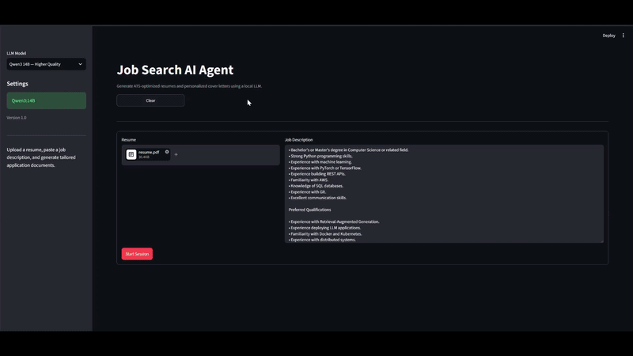
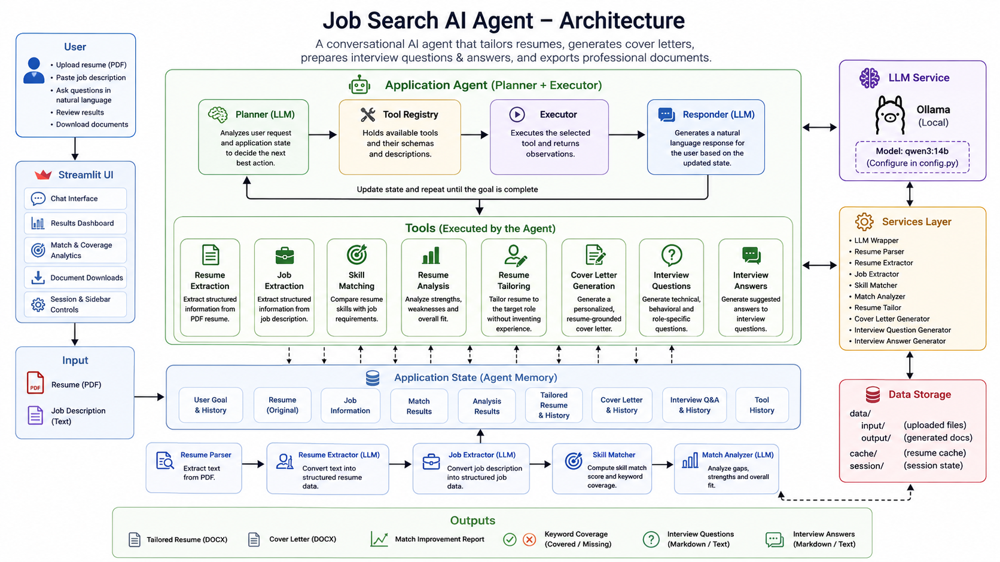

# Job Search AI Agent


An AI-powered conversational job application assistant that uses a modular LLM agent to analyze resumes, understand job descriptions, tailor resumes for specific roles, iteratively revise documents through natural language, generate personalized cover letters, prepare interview questions and answers, and export professional DOCX documents.

The application combines traditional software engineering principles with Large Language Models (LLMs) to automate the most time-consuming parts of the job application process while ensuring generated content remains grounded in the candidate's actual experience.

---

# Demo

<p align="center">
    
</p>

---

# Features

- Upload PDF resumes
- Cache and reuse previously extracted resumes
- Extract structured resume information using an LLM
- Parse job descriptions into structured data
- Compare resume skills against job requirements
- Analyze candidate strengths, weaknesses, and overall fit
- Tailor resumes without inventing experience
- Explain why resume experience and projects were changed
- Compare original and tailored resume match scores
- Measure ATS keyword coverage across resume content
- Show covered and missing job-specific keywords
- Iteratively revise resumes through natural language conversation
- Undo the last resume edit
- Generate personalized, resume-grounded cover letters
- Iteratively revise cover letters through conversation
- Undo the last cover letter edit
- Generate technical interview questions
- Generate behavioral interview questions
- Generate role-specific interview questions
- Generate suggested answers to interview questions
- Export professional DOCX resume and cover letter documents
- Conversational Streamlit interface
- Modular LLM agent with planning and tool execution
- Stateful application sessions

---

# Architecture

The overall application architecture is shown below.

<p align="center">
    
</p>

---

# Agent Workflow

The application processes each user request using a planning agent.

```text
User Request
      │
      ▼
   Planner
      │
      ▼
 Select Tool
      │
      ▼
 Execute Tool
      │
      ▼
Update Agent State
      │
      ▼
 Repeat Until Complete
      │
      ▼
Conversational Response